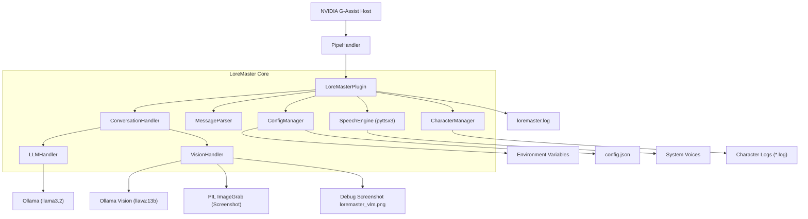
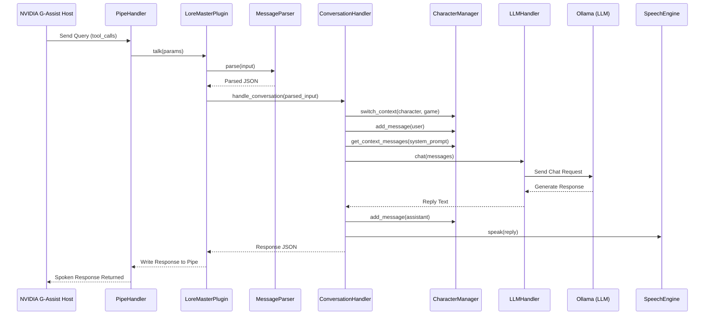
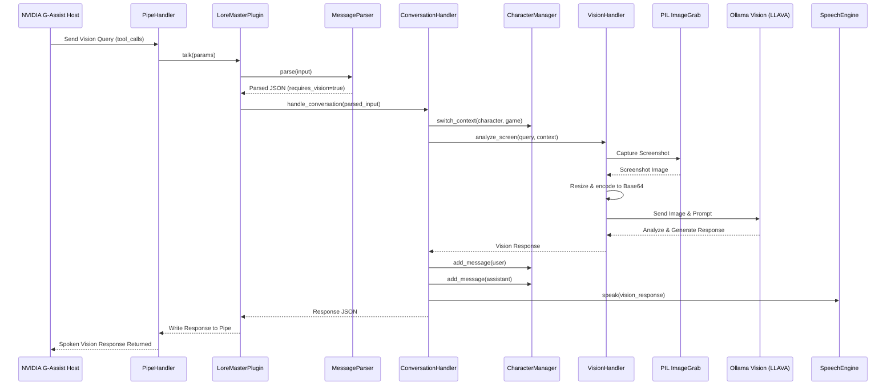
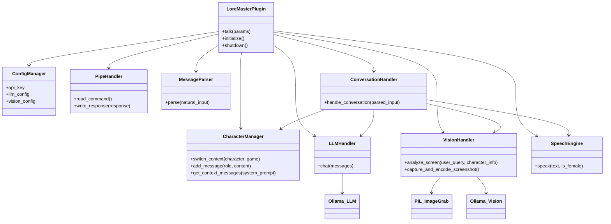

# LoreMaster Plugin for NVIDIA G-Assist - Games Talk Back!

**Talk to your favorite game characters using natural language.**
LoreMaster brings game characters to life using real-time voice synthesis, GPT-4o or Ollama-based LLMs, and now Vision-Language Models (VLMs). Ask lore questions, request puzzle solutions, or challenge your game character about his oversized weapon. If the question requires it, game characters can literally see your screen. Ask things like, "Look at that — what monster is it?!"

Built in under 24 hours for the [NVIDIA Project G-Assist Hackathon](https://developer.nvidia.com/g-assist-hackathon), but still evolving here in dev!
Tag: `#AIonRTXHackathon @NVIDIAGeForce`

---

## Features
* Queries via chat or speech (NVIDIA NeMo STT, ALT+V)
* Voice-enabled character responses using pyttsx3
* Accurate responses for in-game details (e.g., puzzle solutions, unlock codes)
* Character-specific personalities and response styles (e.g., sarcastic, emotional)
* Maintains character/game context across messages
* LLM-powered character emulation using GPT-4o or local Ollama models
* Vision support with screenshot analysis (VLM): Ask questions like "what's on the screen?"
* Smart routing: LoreMaster detects if vision is required and uses the VLM if configured
* Configurable model backend: Mix and match OpenAI (remote) or Ollama (local) for LLM + VLM
* Compatible with G-Assist JSON protocol

---

## Installation & Setup

### 1. Set Up Virtual Environment

```batch
scripts\setup.bat
```

This script:

* Creates `.venv`
* Activates the environment
* Installs dependencies from `requirements.txt`

> Requires Python 3.10+

---

### 2. Build the Plugin

```batch
scripts\build.bat
```

This will:

* Compile the plugin into an executable using PyInstaller
* Place all necessary files in `dist\loremaster\`

Example output:

```
dist/
└── loremaster/
    ├── g-assist-plugin-loremaster.exe
    ├── manifest.json
    └── config.json
```

---

### 3. Install the Plugin in G-Assist

```text
scripts\deploy.bat
```

Restart G-Assist to enable the plugin.

---

## Example Commands

```text
/loremaster Hey what is the optimal strategy to beat that boss?
/loremaster Why is your sword so large? Compensating something?
```

## Dev branch features:

Development continues in the dev branch with major architectural updates:

* Modular plugin design using classes:
LLMHandler, VLMHandler, SpeechEngine, MessageParser, CharacterManager, PipeHandler, and ConversationHandler

* Flexible backend configuration:
Use OpenAI or Ollama for both LLM and VLM

* Mix providers (e.g., OpenAI GPT-4o + Ollama LLava VLM)

* Vision-Aware Character Dialogue:
VisionHandler captures screenshots and sends them to the configured VLM

* Characters stay in voice/personality while referencing visual elements
Intelligent routing: LoreMaster determines when vision is required via LLM parsing (not just keywords)

* New config.json options:
{
  "OPENAI_API_KEY": "",
  "llm": {
    "llm_provider": "ollama",
    "openai_model": "gpt-4o",
    "ollama_model": "llama3.2"
  },
  "vision": {
    "vision_provider": "ollama",
    "openai_vision_model": "gpt-4o",
    "ollama_vision_model": "llava:13b",
    "screenshot_size": [512, 512],
    "screenshot_quality": 85
  }
}

* Optimal Ollama Setup for Low VRAM

If you’re running local Ollama models on a GPU with limited VRAM, use the same model for both LLM and VLM — e.g., llava:13b or llava:7b.

This avoids reloading multiple large models in sequence, which can cause severe slowdowns or timeouts.

* Improved context handling:
Full memory continuity across both text and vision messages
Responses remain immersive and reactive based on both chat and screen state

---

## Developer Notes 

The plugin generates a loremaster.log file in the plugin directory. This log captures all protocol messages and can be useful for debugging and understanding G-Assist communication.

### Testing the Plugin

There are two ways to test the plugin functionality without G-Assist:

#### 1. Command Line Testing
Run the plugin directly with Python, passing your test input as command line arguments:

```batch
python plugin.py "zeus of ancient mythology, what about the lightning bolt?!"
```

This will:
- Initialize the plugin in standalone mode
- Process your input as if it came from G-Assist
- Generate character responses and speech output
- Log all activity to `loremaster.log`

#### 2. Automated Test Suite
Run the comprehensive test suite to validate character responses:

```batch
python tests\test_character_responses.py
```

The test suite includes:
- **Generic Assistant Test**: Tests basic gaming advice functionality
- **Zeus Character Test**: Validates male character personality and mythology knowledge
- **Aphrodite Character Test**: Validates female character personality and love themes

Each test validates:
- Response generation and length
- Character-specific keywords and themes
- Appropriate personality traits
- Success/failure reporting

Both testing methods are especially helpful for rapid prototyping and testing alternative models or configurations during development.

---

## Diagrams

### 1. High-level Architecture Diagram


### 2. Sequence Diagram (Text Query Flow)


### 3. Sequence Diagram (Vision Query Flow)


### 4. Class Diagram


---
## Planned and upcoming features:
* Character-initiated speech triggers — Characters can start speaking in response to in-game events, such as reacting when the player zooms the camera in on them repeatedly (Speech-only — plugin cannot initiate new text outputs in G-Assist yet.)
* Per-game preset packs with tailored personalities and responses.
* Dynamic emotion-aware voice synthesis for more immersive dialogue.

---
## User Responsibility and Disclaimer

**IMPORTANT**: Users are solely responsible for how they use this plugin and must respect all applicable laws and intellectual property rights. LoreMaster is a general-purpose AI conversation tool that can simulate any character or personality based on user input.

**About AI Models**: LoreMaster does not implement its own AI model or contain any training data. It is a client that connects to external AI services (OpenAI GPT models or local Ollama models) that users must configure themselves. Users are responsible for:
- Choosing appropriate AI models and services
- Understanding the training data and capabilities of the models they configure
- Complying with the terms of service of their chosen AI providers
- Being aware that external AI models may have been trained on copyrighted material

**User Responsibilities:**
- Ensure you have the right to use any characters, names, or intellectual property you choose to simulate
- Respect copyright, trademark, and other intellectual property laws in your jurisdiction
- Obtain proper permissions when using copyrighted characters, especially for commercial purposes
- Use the plugin in compliance with applicable terms of service and content policies
- Understand that AI-generated content may not accurately represent official character lore or canon
- Verify that your chosen AI models and providers are appropriate for your intended use

**Disclaimer**: The developers of LoreMaster are not responsible for user-generated content, copyright infringement, or misuse of intellectual property. This tool is provided "as-is" for educational and entertainment purposes. Users assume all legal responsibility for their use of the plugin and their choice of AI models/services.

---

## License and Commercial Use

LoreMaster is released under the MIT License for personal and non-commercial use.

### Commercial Use Requires a License

If you intend to use LoreMaster in a commercial product, resale, hosted service, or any monetized application, you must obtain a commercial license from the author.

**Contact:** mika.wilen.tuni@gmail.com

You are free to:
- Fork, modify, and share the code for non-commercial purposes
- Use the plugin privately or within personal projects
- Build demos, content, or mods using LoreMaster in a non-monetized way

But you **may not**:
- Sell or monetize forks of LoreMaster
- Integrate LoreMaster into commercial services or products without a license
- Use the LoreMaster name or branding to imply endorsement of unofficial versions

See [`COMMERCIAL.md`](COMMERCIAL.md) for full terms.
