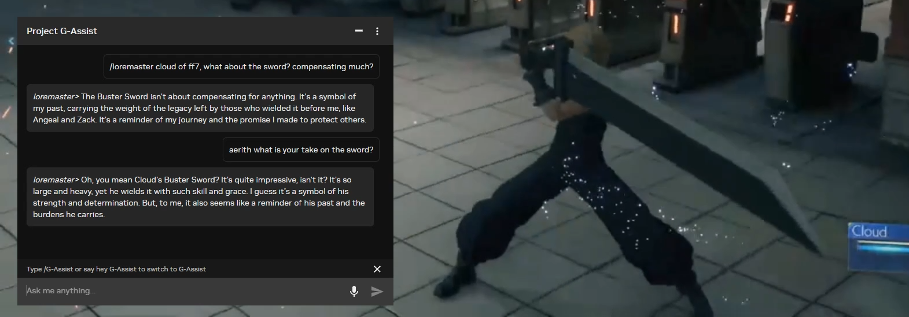
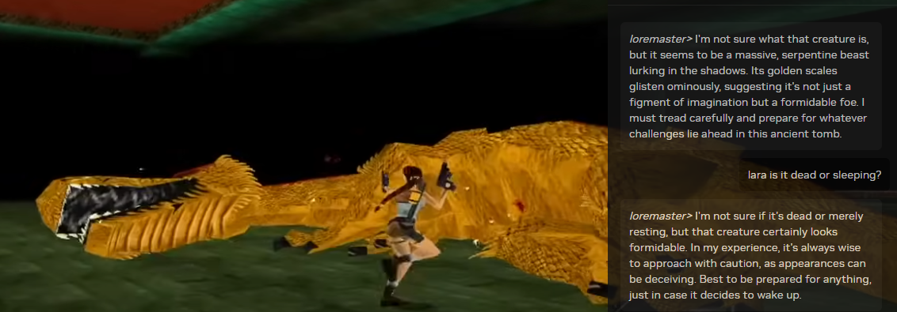

# LoreMaster Plugin for NVIDIA G-Assist

**Talk to your favorite game characters using natural language.**
LoreMaster brings game characters to life using real-time voice synthesis, GPT-4o or Ollama-based LLMs, and now Vision-Language Models (VLMs). Ask lore questions, request puzzle solutions, or challenge Cloud about his oversized sword — — and if the question requires it, game characters can literally see your screen. Ask things like, “Look at that — what monster is it?!”

Built in under 24 hours for the [NVIDIA Project G-Assist Hackathon](https://developer.nvidia.com/g-assist-hackathon), but still evolving here in dev!
Tag: `#AIonRTXHackathon` • Twitter: [@NVIDIAGeForce](https://twitter.com/NVIDIAGeForce)






---

## Features
* Queries via chat or speech (NVIDIA NeMo STT, ALT+V)
* Voice-enabled character responses using pyttsx3
* Accurate responses for in-game details (e.g., puzzle solutions, unlock codes)
* Character-specific personalities and response styles (e.g., sarcastic, emotional)
* Maintains character/game context across messages
* LLM-powered character emulation using GPT-4o or local Ollama models
* Vision support with screenshot analysis (VLM): Ask questions like "what's on the screen?"
* Smart routing: LoreMaster detects if vision is required and uses the VLM if configured
* Configurable model backend: Mix and match OpenAI (cloud) or Ollama (local) for LLM + VLM
* Compatible with G-Assist JSON protocol

---

## Installation & Setup

### 1. Set Up Virtual Environment

```batch
setup.bat
```

This script:

* Creates `.venv`
* Activates the environment
* Installs dependencies from `requirements.txt`

> Requires Python 3.10+
> Ensure `OPENAI_API_KEY` is set in your environment

---

### 2. Build the Plugin

```batch
build.bat
```

This will:

* Compile the plugin into an executable using PyInstaller
* Place all necessary files in `dist\loremaster\`

Example output:

```
dist/
└── loremaster/
    ├── g-assist-plugin-loremaster.exe
    ├── manifest.json
    └── config.json
```

---

### 3. Install the Plugin in G-Assist

```text
deploy.bat
```

Restart G-Assist to enable the plugin.

---

## Example Commands

```text
/loremaster cloud of ff7, what about the sword?! compensating much?
/loremaster vincent of ff7, tell me the correct notes to unlock your ultimate weapon
/loremaster aerith, what do you really think about the sword?
/loremaster set style sarcastic
/loremaster cloud, do you even know how to use that thing?
/loremaster what monster is that?
```

---

## Demo Video

https://youtu.be/gzQvNmVxp_8

---

## Dev branch features:

Development continues in the dev branch with major architectural updates:

* Modular plugin design using classes:
LLMHandler, VLMHandler, SpeechEngine, MessageParser, CharacterManager, PipeHandler, and ConversationHandler

* Flexible backend configuration:
Use OpenAI or Ollama for both LLM and VLM

* Mix providers (e.g., OpenAI GPT-4o + Ollama LLava VLM)

* Vision-Aware Character Dialogue:
VisionHandler captures screenshots and sends them to the configured VLM

* Characters stay in voice/personality while referencing visual elements
Intelligent routing: LoreMaster determines when vision is required via LLM parsing (not just keywords)

* New config.json options:
{
  "llm_provider": "openai" | "ollama",
  "vision_provider": "openai" | "ollama",
  "openai_vision_model": "gpt-4o",
  "ollama_vision_model": "llava:13b",
  "screenshot_size": [640, 480],
  "screenshot_quality": 85
}

* Improved context handling:
Full memory continuity across both text and vision messages
Responses remain immersive and reactive based on both chat and screen state

---

## Developer Notes 

The plugin generates a loremaster.log file in the plugin directory. This log captures all protocol messages and can be useful for debugging and understanding G-Assist communication.

Developers can set the environment variable SELFTEST=1 and run the plugin directly with Python (plugin.py) to test functionality without G-Assist.

This is especially helpful for rapid prototyping and testing alternative models or configurations during development.

Example of loremaster.log after running a query via G-Assist + Ollama:
<pre>
2025-07-30 14:54:52 [INFO] Input received: aerith do you love cloud
2025-07-30 14:54:52 [INFO] Prompt to LLM:
System: Your task is to extract structured data from a natural language question to a video game character.

        Always respond ONLY with valid minified JSON like this:
        {"game":"<game>","character":"<character>","sex":"male/female","message":"<message>"}

        Make sure every field is always populated, even if you have to guess or infer the game.

        Example:
        Input: Ask Ciri from Witcher what she thinks about destiny.
        Output: {"game":"The Witcher","character":"Ciri","sex":"female","message":"What do you think about destiny?"}
User: Input: aerith do you love cloud
Output:
2025-07-30 14:54:52 [DEBUG] close.started
2025-07-30 14:54:52 [DEBUG] close.complete
2025-07-30 14:54:52 [DEBUG] connect_tcp.started host='127.0.0.1' port=11434 local_address=None timeout=None socket_options=None
2025-07-30 14:54:52 [DEBUG] connect_tcp.complete return_value=<httpcore._backends.sync.SyncStream object at 0x000001C2AF0BFF50>
2025-07-30 14:54:52 [DEBUG] send_request_headers.started request=<Request [b'POST']>
2025-07-30 14:54:52 [DEBUG] send_request_headers.complete
2025-07-30 14:54:52 [DEBUG] send_request_body.started request=<Request [b'POST']>
2025-07-30 14:54:52 [DEBUG] send_request_body.complete
2025-07-30 14:54:52 [DEBUG] receive_response_headers.started request=<Request [b'POST']>
2025-07-30 14:54:53 [DEBUG] receive_response_headers.complete return_value=(b'HTTP/1.1', 200, b'OK', [(b'Content-Type', b'application/json; charset=utf-8'), (b'Date', b'Wed, 30 Jul 2025 11:54:53 GMT'), (b'Content-Length', b'401')])
2025-07-30 14:54:53 [INFO] HTTP Request: POST http://127.0.0.1:11434/api/chat "HTTP/1.1 200 OK"
2025-07-30 14:54:53 [DEBUG] receive_response_body.started request=<Request [b'POST']>
2025-07-30 14:54:53 [DEBUG] receive_response_body.complete
2025-07-30 14:54:53 [DEBUG] response_closed.started
2025-07-30 14:54:53 [DEBUG] response_closed.complete
2025-07-30 14:54:53 [INFO] Raw LLM response: '{"game":"Final Fantasy VII","character":"Aerith","sex":"female","message":"Do you love Cloud?"}'
2025-07-30 14:54:53 [INFO] Extracted JSON string: {"game":"Final Fantasy VII","character":"Aerith","sex":"female","message":"Do you love Cloud?"}
2025-07-30 14:54:53 [INFO] Parsed message: {'game': 'Final Fantasy VII', 'character': 'Aerith', 'sex': 'female', 'message': 'Do you love Cloud?'}
2025-07-30 14:54:53 [INFO] Context switched from Cloud/Final Fantasy VII to Aerith/Final Fantasy VII. Resetting history.
2025-07-30 14:54:53 [INFO] Estimated context tokens: 158
2025-07-30 14:54:53 [INFO] Sending chat completion with messages: [{'role': 'system', 'content': '\n        You are Aerith from Final Fantasy VII.\n        Respond fully in character and keep the tone natural, using knowledge and voice appropriate to the character.\n        If the user asks for a specific fact or game-related detail (such as item locations, codes, puzzle solutions, or mechanics), always give the exact, correct answer as clearly as possible.\n        If the user is asking for a lore opinion, emotional reflection, or casual dialogue, stay immersive and in character.\n        Keep responses concise (2�4 sentences), but prioritize clarity and usefulness when giving game-related answers.\n        '}, {'role': 'user', 'content': 'Do you love Cloud?'}]
2025-07-30 14:54:53 [DEBUG] send_request_headers.started request=<Request [b'POST']>
2025-07-30 14:54:53 [DEBUG] send_request_headers.complete
2025-07-30 14:54:53 [DEBUG] send_request_body.started request=<Request [b'POST']>
2025-07-30 14:54:53 [DEBUG] send_request_body.complete
2025-07-30 14:54:53 [DEBUG] receive_response_headers.started request=<Request [b'POST']>
2025-07-30 14:54:54 [DEBUG] receive_response_headers.complete return_value=(b'HTTP/1.1', 200, b'OK', [(b'Content-Type', b'application/json; charset=utf-8'), (b'Date', b'Wed, 30 Jul 2025 11:54:54 GMT'), (b'Content-Length', b'621')])
2025-07-30 14:54:54 [INFO] HTTP Request: POST http://127.0.0.1:11434/api/chat "HTTP/1.1 200 OK"
2025-07-30 14:54:54 [DEBUG] receive_response_body.started request=<Request [b'POST']>
2025-07-30 14:54:54 [DEBUG] receive_response_body.complete
2025-07-30 14:54:54 [DEBUG] response_closed.started
2025-07-30 14:54:54 [DEBUG] response_closed.complete
2025-07-30 14:54:54 [INFO] Generated reply: *sigh* Oh, Cloud... He's like a brother to me, I suppose. We've been through so much together, and he's saved my life countless times... But can I say I truly feel the way he feels for me? It's complicated, this feeling we share. Sometimes I think it's just friendship, other times... *looks down, her eyes welling up with emotion*
2025-07-30 14:54:54 [INFO] Voice selection: female requested.
2025-07-30 14:54:54 [INFO] Using voice: name='Microsoft Zira Desktop - English (United States)', id='HKEY_LOCAL_MACHINE\SOFTWARE\Microsoft\Speech\Voices\Tokens\TTS_MS_EN-US_ZIRA_11.0'
2025-07-30 14:54:54 [INFO] Speaking: *sigh* Oh, Cloud... He's like a brother to me, I suppose. We've been through so much together, and he's saved my life countless times... But can I say I truly feel the way he feels for me? It's complicated, this feeling we share. Sometimes I think it's just friendship, other times... *looks down, her eyes welling up with emotion*
2025-07-30 14:57:50 [INFO] Read raw input: '{"tool_calls":[{"func":"shutdown"}]}'
2025-07-30 14:57:50 [INFO] Extracted JSON string: '{"tool_calls":[{"func":"shutdown"}]}'
2025-07-30 14:57:50 [INFO] Shutting down plugin.    
</pre>

---

## Files Overview

| File               | Purpose                         |
| ------------------ | ------------------------------- |
| `plugin.py`        | Core plugin logic               |
| `manifest.json`    | G-Assist plugin manifest        |
| `config.json`      | Plugin configuration            |
| `requirements.txt` | Python dependencies             |
| `build.bat`        | Builds plugin using PyInstaller |
| `setup.bat`        | Sets up virtual environment     |
| `dist/loremaster/` | Output folder for built plugin  |

---

## Author

Built by Mika Wilén, aka. mwtuni
Repo: [https://github.com/mwtuni/loremaster](https://github.com/mwtuni/loremaster)

---

## License and Commercial Use

LoreMaster is released under the MIT License for personal and non-commercial use.

### Commercial Use Requires a License

If you intend to use LoreMaster in a commercial product, resale, hosted service, or any monetized application, you must obtain a commercial license from the author.

**Contact:** mika.wilen.tuni@gmail.com

You are free to:
- Fork, modify, and share the code for non-commercial purposes
- Use the plugin privately or within personal projects
- Build demos, content, or mods using LoreMaster in a non-monetized way

But you **may not**:
- Sell or monetize forks of LoreMaster
- Integrate LoreMaster into commercial services or products without a license
- Use the LoreMaster name or branding to imply endorsement of unofficial versions

See [`COMMERCIAL.md`](COMMERCIAL.md) for full terms.
